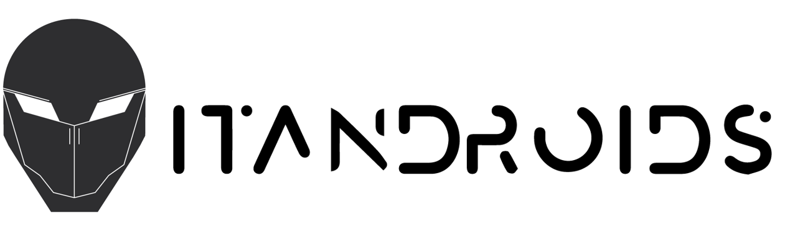

# AI study

This is a repository for study Artificial inteligence for robotic movel, in this case, soccer simulation 2D.

## Behavior Thee and Finite State Machine

The first challenge is to implement a soccer field that has two players and a ball. Think about how to implement the collision with players and ball. Before, think about the friction on the ball.

Deadline: 13/11/2019
